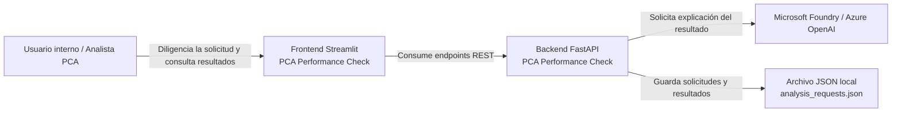

# C4 – Contexto del sistema

## Propósito

Mostrar cómo **PCA Performance Check** se relaciona con sus actores y con los sistemas externos relevantes.

## Lectura del diagrama

- El **usuario** interactúa con el **frontend Streamlit**.
- El **frontend** consume la **API FastAPI** para registrar solicitudes, ejecutar análisis y consultar resultados.
- El **backend** usa **Microsoft Foundry / Azure OpenAI** únicamente para explicar el resultado técnico.
- El **backend** persiste solicitudes y resultados en un **archivo JSON local**, propio del MVP actual.

## Observación importante

Este diagrama muestra **relaciones de contexto**, no componentes internos del backend.
