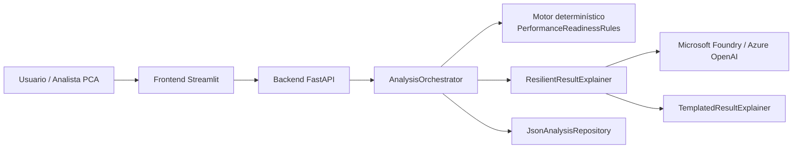

# Resumen de arquitectura

## Propósito

Explicar de forma simple cómo está compuesto PCA Performance Check y qué responsabilidad tiene cada parte.

## Explicación

### Frontend Streamlit
Es la interfaz del usuario.  
Permite diligenciar la solicitud y mostrar el resultado del análisis.

### Backend FastAPI
Recibe la solicitud, coordina la ejecución del análisis y devuelve el resultado estructurado.

### AnalysisOrchestrator
Coordina el flujo completo:
- obtiene la solicitud
- ejecuta las reglas
- pide la explicación
- guarda el resultado

### Motor determinístico
Es la parte central del sistema.  
Calcula:

- readiness score
- decisión
- riesgo
- tipo de prueba recomendado
- brechas
- hallazgos de riesgo

### ResilientResultExplainer
Decide qué explicador usar:
- Azure OpenAI si Foundry está disponible
- fallback local si no está disponible o falla

### Microsoft Foundry / Azure OpenAI
Se usa cuando está disponible para generar la explicación asistida.

### TemplatedResultExplainer
Genera una explicación local controlada cuando Foundry no se puede usar.

### JsonAnalysisRepository
Guarda solicitudes y resultados del MVP.
