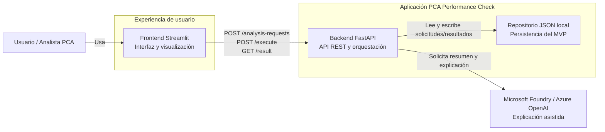

# C4 – Contenedores

## Propósito

Mostrar los contenedores principales de la solución y la responsabilidad de cada uno.

## Contenedores

### Frontend Streamlit
Responsable de:
- capturar la solicitud
- ejecutar el flujo de demo
- mostrar score, decisión, riesgo y explicación

### Backend FastAPI
Responsable de:
- exponer endpoints
- validar la solicitud
- ejecutar el motor determinístico
- coordinar persistencia y explicación

### Repositorio JSON local
Responsable de:
- guardar solicitudes
- guardar resultados
- soportar el MVP local

### Microsoft Foundry / Azure OpenAI
Responsable de:
- transformar el resultado técnico en una explicación clara

## Qué no muestra este diagrama

No muestra casos de uso, clases ni servicios internos del backend.  
Eso pertenece al nivel de **Componentes**.
