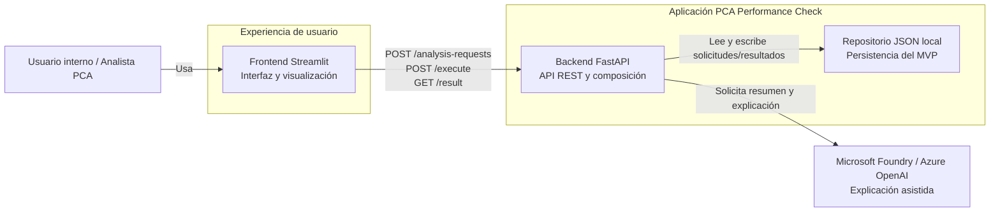

# C4 – Contenedores

## Propósito

Mostrar los contenedores que componen la solución y la responsabilidad de cada uno.

## Contenedores identificados

### Frontend Streamlit
Responsable de:
- capturar la solicitud,
- enviar la información al backend,
- mostrar métricas, brechas, riesgos y explicación.

### Backend FastAPI
Responsable de:
- validar el contrato de entrada,
- exponer endpoints,
- ejecutar el motor determinístico,
- coordinar repositorio y explicador.

### Repositorio JSON local
Responsable de:
- persistir solicitudes,
- persistir resultados,
- soportar la demo del MVP.

### Microsoft Foundry / Azure OpenAI
Responsable de:
- convertir el resultado técnico en texto claro para el usuario final.

## Observación importante

En este nivel todavía **no** se muestran clases, casos de uso ni componentes internos.
