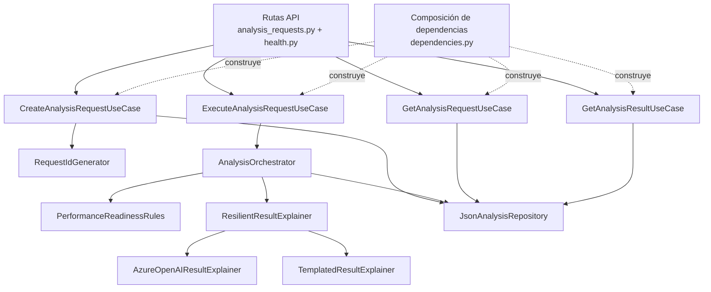

# C4 – Componentes del backend

## Propósito

Mostrar las piezas internas más relevantes del backend y cómo colaboran entre sí.

## Explicación de los componentes

### Rutas API
Reciben la solicitud HTTP y delegan a casos de uso específicos.

### Casos de uso
Cada endpoint tiene una responsabilidad clara:
- crear solicitud,
- ejecutar análisis,
- consultar solicitud,
- consultar resultado.

### RequestIdGenerator
Genera el identificador funcional de cada solicitud.

### AnalysisOrchestrator
Coordina el flujo completo de ejecución:
1. recupera la solicitud,
2. llama al motor determinístico,
3. arma el payload para la explicación,
4. invoca al explicador,
5. persiste el resultado.

### PerformanceReadinessRules
Contiene el conocimiento del dominio del MVP:
- score,
- brechas,
- riesgos,
- decisión,
- prueba recomendada.

### ResilientResultExplainer
Aísla la aplicación de fallos del proveedor IA:
- usa Azure OpenAI si está disponible,
- usa fallback templado si falla o no está configurado.

### JsonAnalysisRepository
Abstrae el acceso a la persistencia local.
