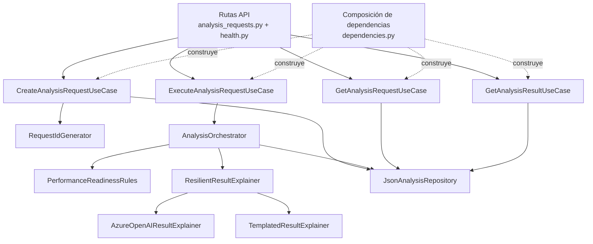

# C4 – Componentes del backend

## Propósito

Mostrar las piezas internas más relevantes del backend y cómo colaboran entre sí.

## Explicación de componentes

### Rutas API
Reciben la solicitud HTTP y delegan el trabajo a los casos de uso.

### Casos de uso
Cada endpoint tiene una responsabilidad clara:
- crear solicitud
- ejecutar análisis
- consultar solicitud
- consultar resultado

### RequestIdGenerator
Genera el identificador funcional de cada solicitud.

### AnalysisOrchestrator
Coordina el flujo de ejecución:
1. recupera la solicitud
2. ejecuta el motor determinístico
3. arma el payload para la explicación
4. solicita la explicación
5. persiste el resultado

### PerformanceReadinessRules
Contiene la lógica central del proyecto:
- score
- brechas
- riesgos
- decisión
- prueba recomendada

### ResilientResultExplainer
Decide qué camino usar:
- **AzureOpenAIResultExplainer** si Foundry está disponible
- **TemplatedResultExplainer** si Foundry falla o no está configurado

### JsonAnalysisRepository
Abstrae el acceso al almacenamiento local del MVP.
