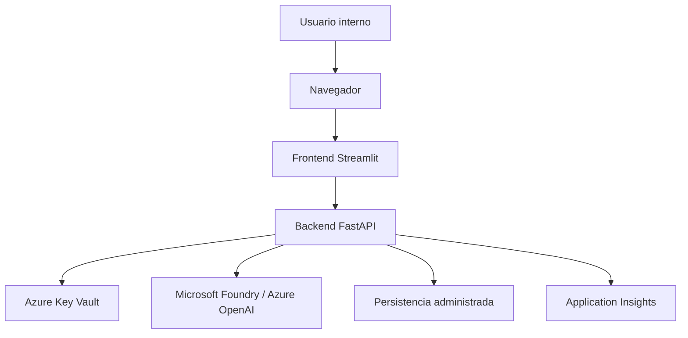

# Despliegue objetivo

## Propósito

Mostrar cómo podría evolucionar la solución a una arquitectura más empresarial sin complicar la lectura del MVP.

## Evolución esperada

En una siguiente fase se recomienda:

- reemplazar el repositorio JSON por persistencia administrada
- mover secretos y configuración sensible a Key Vault
- agregar observabilidad técnica real
- desplegar frontend y backend como servicios separados
