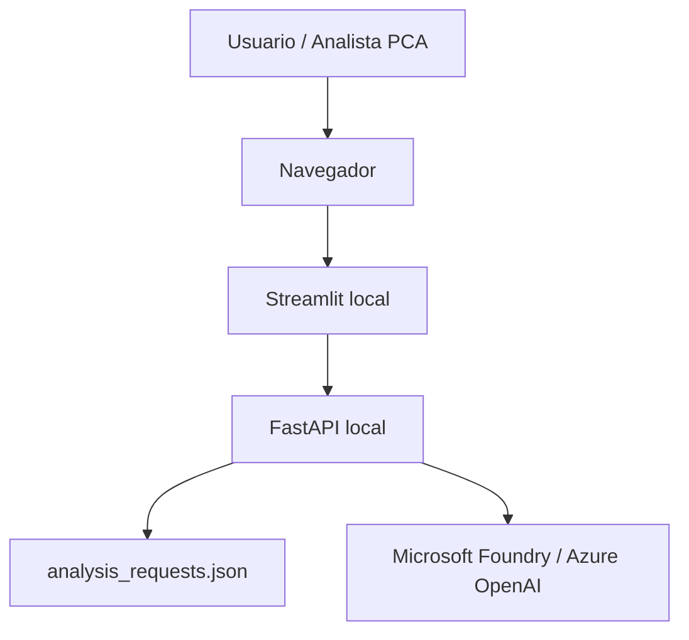
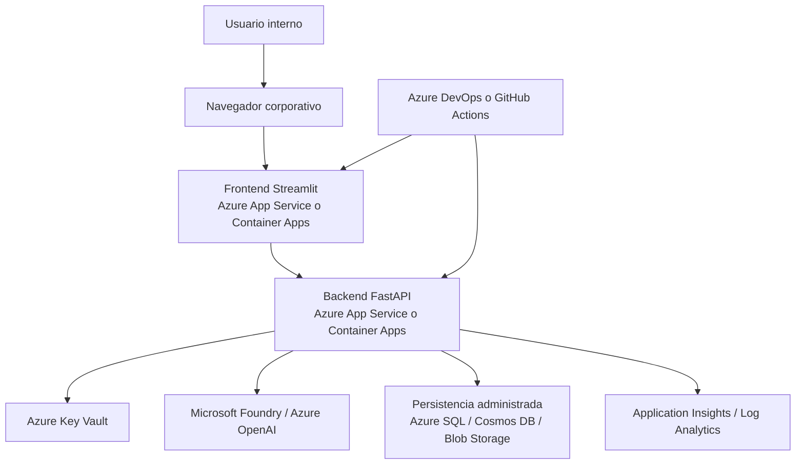

# Topología actual y despliegue objetivo

## 1. Topología actual del proyecto

La topología actual corresponde a una ejecución local orientada a demostración y validación funcional.

### Características de la topología actual

- orientada a demo,
- persistencia local,
- configuración vía `.env`,
- integración opcional con Foundry,
- fallback local si la IA falla.

## 2. Despliegue objetivo recomendado en Azure

Para una evolución más empresarial, la topología sugerida sería esta:

## Principios recomendados

### Separación de responsabilidades
Frontend y backend deben desplegar de manera independiente.

### Gestión de secretos
Las credenciales deben salir del `.env` local y pasar a **Key Vault**.

### Persistencia empresarial
El JSON local debe reemplazarse por un almacenamiento administrado.

### Observabilidad
El backend debe emitir métricas, logs y trazas a una plataforma central.

### Continuidad funcional
El patrón de **explicador resiliente** debe mantenerse incluso en entornos productivos.
