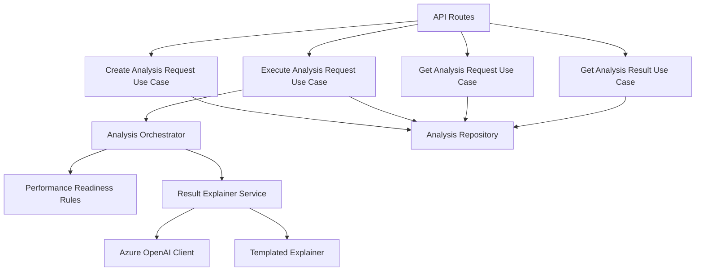

# C4 – Componentes

## Componentes clave

- **Performance Readiness Rules**: score, riesgos, decisión y recomendación.
- **Result Explainer Service**: decide si usa Foundry o fallback local.
- **Azure OpenAI Client**: integra el deployment configurado en Foundry.
- **Templated Explainer**: garantiza continuidad si la IA falla.
