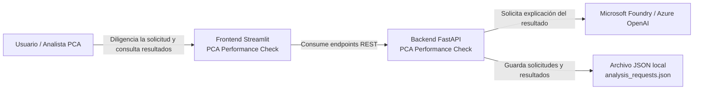

# C4 – Contexto

## Propósito

Mostrar cómo PCA Performance Check se relaciona con sus actores y sistemas externos.

## Lectura

- El **usuario** interactúa con el **frontend Streamlit**.
- El **frontend** consume la **API FastAPI**.
- El **backend** usa **Foundry** solo para explicar el resultado.
- El **backend** persiste solicitudes y resultados en un **JSON local**, propio del MVP actual.

## Qué no muestra este diagrama

No muestra clases ni componentes internos del backend.  
Solo muestra el sistema en relación con actores y dependencias externas.
