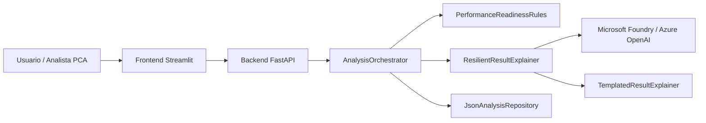

# Resumen de arquitectura

## Propósito

Explicar de forma simple cómo está compuesto PCA Performance Check y cuál es la responsabilidad de cada parte.

## Explicación

### Frontend Streamlit
Es la interfaz del usuario.  
Permite diligenciar la solicitud y visualizar el resultado técnico y la explicación final.

### Backend FastAPI
Recibe la solicitud, coordina la ejecución del análisis y expone los endpoints consumidos por el frontend.

### AnalysisOrchestrator
Coordina el flujo completo:
- obtiene la solicitud
- ejecuta las reglas
- pide la explicación
- guarda el resultado

### PerformanceReadinessRules
Es el motor determinístico del sistema.  
Calcula:
- readiness score
- decisión
- riesgo
- tipo de prueba recomendado
- prerequisitos faltantes
- hallazgos de riesgo

### ResilientResultExplainer
Decide qué explicador usar:
- Azure OpenAI si Foundry está disponible
- fallback local si Foundry falla o no está configurado

### Microsoft Foundry / Azure OpenAI
Se usa únicamente para generar una explicación clara del resultado técnico.

### TemplatedResultExplainer
Genera una explicación local controlada cuando no se puede usar Foundry.

### JsonAnalysisRepository
Guarda solicitudes y resultados del MVP.
